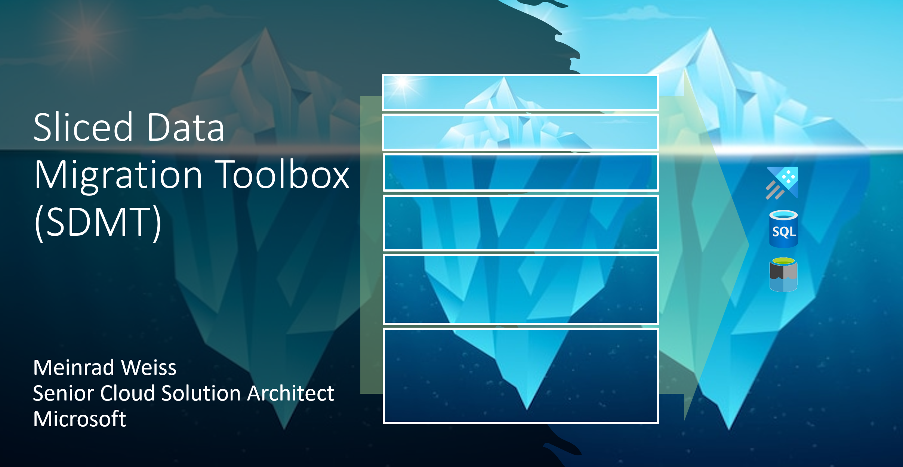
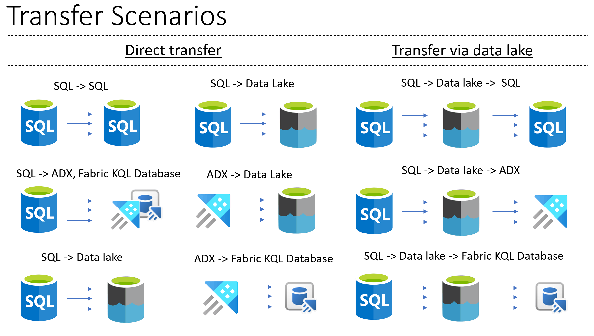
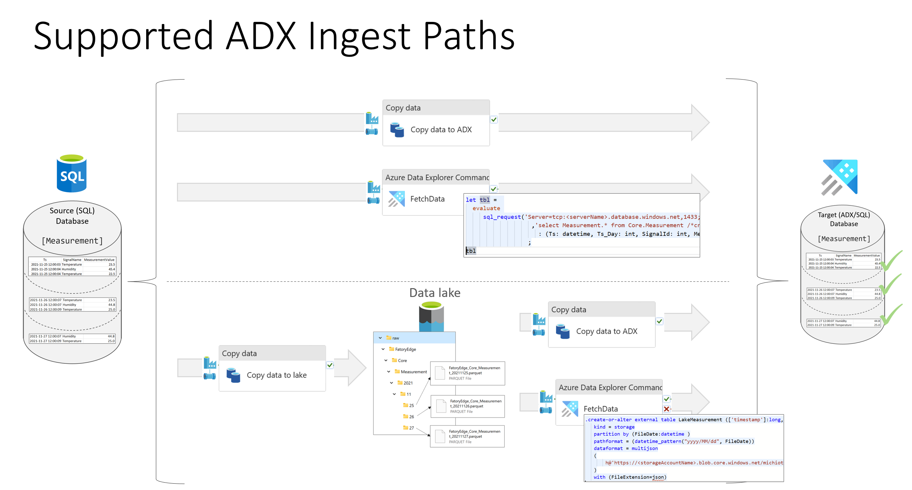
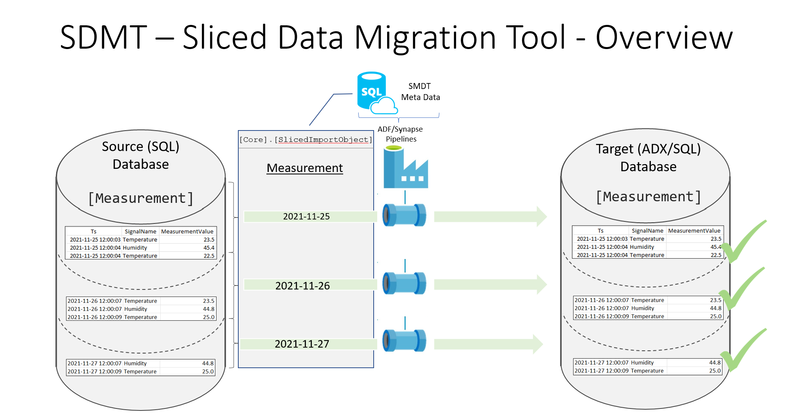
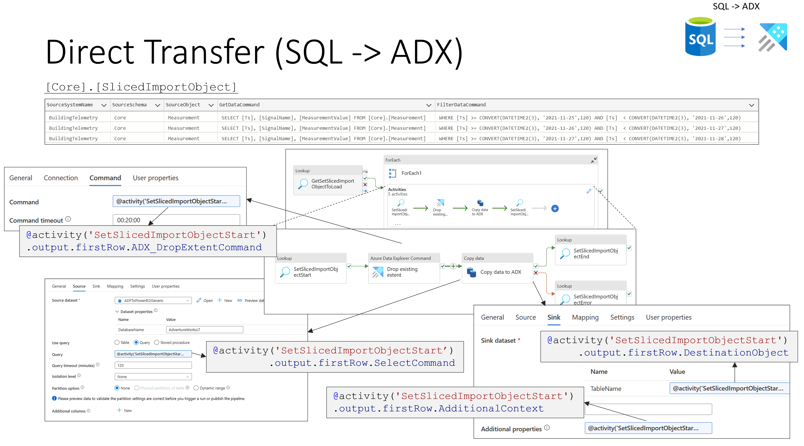
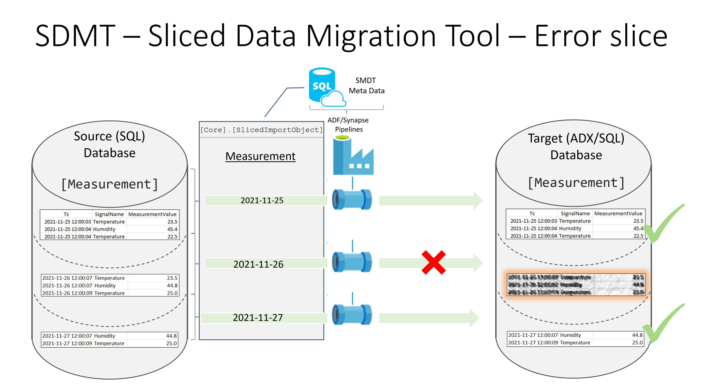
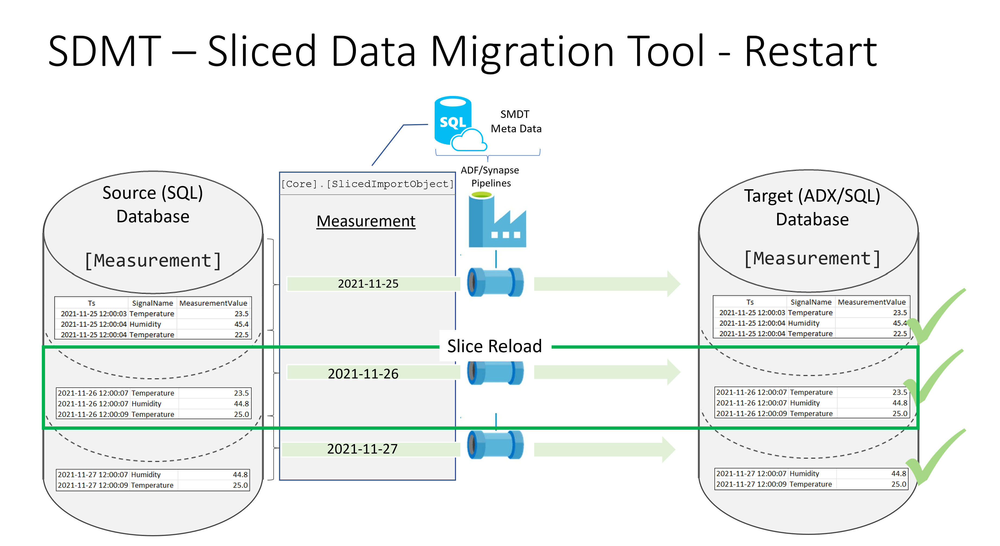
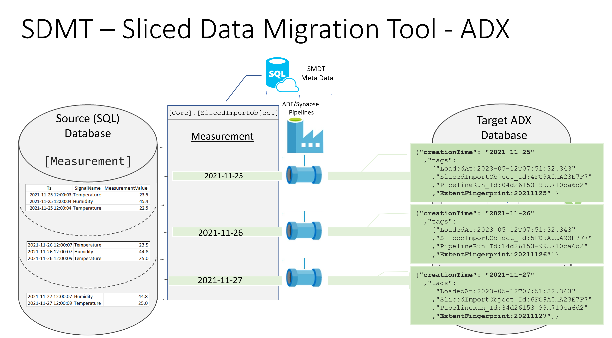
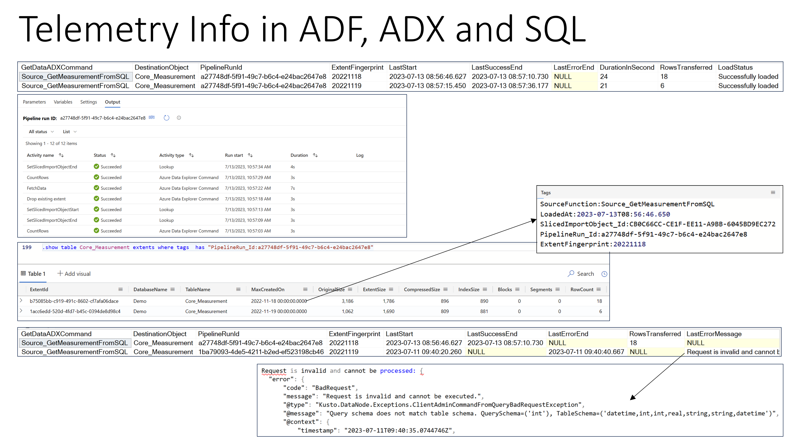

# SDMT - Sliced data migration toolbox

## Overview

If data is migrated from an on-premises system to a modern data warehouse or in an Azure Data eXplorer (ADX) database, then often historical data, must be migrated to the new data services in Azure.  
The sliced data migration toolbox provides framework components to simplify the data migration.

 
 

 

- [SDMT - Sliced data migration toolbox](#sdmt---sliced-data-migration-toolbox)
  - [Overview](#overview)
    - [Main Benefits of the toolbox](#main-benefits-of-the-toolbox)
    - [Common transfer stages](#common-transfer-stages)
    - [Meta data](#meta-data)
    - [Big picture](#big-picture)
    - [High level view on direct transfer pipeline](#high-level-view-on-direct-transfer-pipeline)
      - [Example: Direct transfer to Azure ADX Database](#example-direct-transfer-to-azure-adx-database)
    - [Reload of data slices](#reload-of-data-slices)
    - [Handling of creationTime and tags](#handling-of-creationtime-and-tags)
  - [Setup and next steps](#setup-and-next-steps)
  - [Contributing](#contributing)
  - [Trademarks](#trademarks)

 
 

### Main Benefits of the toolbox

The toolbox provides the following main benefits:
* Proven framework to migrate data in an efficient and governed way.
* Flexible architecture to support different scenarios. It is possible to integrate the SDMT pipelines in a broader ETL/date migration scenario.
* It is possible to load huge datasets in well-defined, small slices.
  * Sequential and parallel load of the slices is supported (pipeline defines how many parallel loads are executed)
  * Data transfer workload can scale out over different integration runtimes to optimize performance.
  * If a slice fails, then it can be restarted, without data duplication.
* 	The ADX property “creationTime” is set correctly. 
* 	Each data transfer is logged in the meta data database (duration, number of rows transferred) and ADX tags provide additional information to each extent.
    * "LoadedAt: <UTCDateTime of the start of the data transfer of this slice>"
    * "SlicedImportObject_Id:<Primary key value of the slice in the SDMT meta data database>"
    * "PipelineRun_Id:<Run id of the pipeline used for the tranfer>"
    * "ExtentFingerprint:<Identification of the slice. Used to clean up a slice in the case of a reload"
    *	"SourceFunction:<ADX function used to get data>"
* 	Simple pipelines with any complex logic, the required values are provided by the stored procedures of the toolbox.

 

### Common transfer stages

Depending on the shape of the pipeline you can choose one of the following options:
 * SQL Source[^1] -> Database destination (e.g. ADX, SQL, PostgreSQL, ...) [^2] 
 * SQL Source[^1] -> Data lake  
 * SQL Source[^1] -> Data lake -> Database destination (e.g. ADX, SQL, PostgreSQL, ...)[^2]
 * ADX Source -> Data lake (via external table)
 

If ADX is the target, then it is possible to choose one of the following paths.
* SQL Source[^1] -> ADX via Copy activity
* SQL Source     -> ADX using sql_request
* SQL Source[^1] -> Data lake via Copy activity -> ADX via Copy activity
* SQL Source[^1] -> Data lake via Copy activity -> ADX using an external table
* Data lake      -> ADX using an external table
  

 
 

[^1]: Any SQL source that is supported by ADF/Synpase pipelines. 
[^2]: Any pipeline sink that supports insert/apppend. Samples provided for Azure SQL and Azure Data Explorer.

 
 

### Meta data

The whole data transfer is steered by meta data. Depending on the scenario, different meta data is required. Common meta data is:
 * Data transfer application name
 * Source object
 * Destination object
 * Start date 
 * End date
 * Slice size (day or month)

 

 
 

### Big picture

To transfer data from a source to a destination, the following steps are required:
 * Create the required objects in the metadata database and the destination database.
   * Create the meta data database (deploy the database project). 
   * Create the necessary ADX artifacts (tables, functions, ...)
 * Create slice meta data. The most efficient way is to use the stored procedure `[Helper].[GenerateSliceMetaData]`. 
 * Pick the corresponding ADF/Synapes pipeline, specify the required start parameters (@Mode=`REGULAR`) and execute it.
   * If some slices failed to loaded, then the pipeline can be restarted (@Mode=`RESTART`). The pipeline will only re-load the missing slices.

### High level view on direct transfer pipeline

 

For a direct transfer of the data slices just a few activities are required, and the properties can be filled by using the output of the stored procedures provided by the framework. This makes building the pipelines very efficient and the maintenance can be done at a central place.

#### Example: Direct transfer to Azure ADX Database

 
 

### Reload of data slices

Failed loads of slices will will be reported in the meta data database.

 
 

And a single slice can be reload in a controlled fashion.

 
 

### Handling of creationTime and tags

One important feature of ADX is the functionality to define caching policies and to keep selected data in the hot cache. To be able to decide if data should be available in the hot cache, ADX keeps track on the age via meta data in the extent definition. If historical data is loaded, then it is essential that we provide the age of the records via a "hint". The toolbox provides this information direct as a property. 

 
 

With the combination of the log entries in Azure Data Factory/Synapse Pipelines, the SDMT tables and the ADX tags it is possible to get a full end to end view and relate pipeline runs to extents in ADX.

## Setup and next steps

 * [Setup SDMT](./doc/01SetupSMDT.md)

 * Load data to ADX 
   * [Transfer SQL to ADX with the copy activity](./doc/transfer/ToADX/10SQLToADXCopy.md).
   * [Transfer SQL to ADX using ADX function](./doc/transfer/ToADX/20SQLToADX_ADXFunction.md).
   * [Transfer Lake to ADX using ADX function](./doc/transfer/ToADX/25LakeToADX_ADXFunction.md).
   * [Transfer SQL to Lake using copy activity](./doc/transfer/ToLake/30SQLToLakeCopy.md).
   * [Transfer SQL to Lake to ADX using copy activity and ADX function](./doc/transfer/ToADX/35SQLToLakeToADXFunction.md).
 * Export data from ADX to the data lake 
    * [Export data](./doc/transfer/ADXExport/50ADXExportToLake.md).
 * Documentation
   * [Database Objects](./doc/10DatabaseObjects.md)
   * [Pipeline Parameters](./doc/20PipelineParameters.md)
   * [Tips and Tricks plus Q&A](./doc/90TipsAndTricks_QaA.md)

## Contributing

This project welcomes contributions and suggestions.  Most contributions require you to agree to a
Contributor License Agreement (CLA) declaring that you have the right to, and actually do, grant us
the rights to use your contribution. For details, visit https://cla.opensource.microsoft.com.

When you submit a pull request, a CLA bot will automatically determine whether you need to provide
a CLA and decorate the PR appropriately (e.g., status check, comment). Simply follow the instructions
provided by the bot. You will only need to do this once across all repos using our CLA.

This project has adopted the [Microsoft Open Source Code of Conduct](https://opensource.microsoft.com/codeofconduct/).
For more information see the [Code of Conduct FAQ](https://opensource.microsoft.com/codeofconduct/faq/) or
contact [opencode@microsoft.com](mailto:opencode@microsoft.com) with any additional questions or comments.

## Trademarks

This project may contain trademarks or logos for projects, products, or services. Authorized use of Microsoft 
trademarks or logos is subject to and must follow 
[Microsoft's Trademark & Brand Guidelines](https://www.microsoft.com/en-us/legal/intellectualproperty/trademarks/usage/general).
Use of Microsoft trademarks or logos in modified versions of this project must not cause confusion or imply Microsoft sponsorship.
Any use of third-party trademarks or logos are subject to those third-party's policies.
