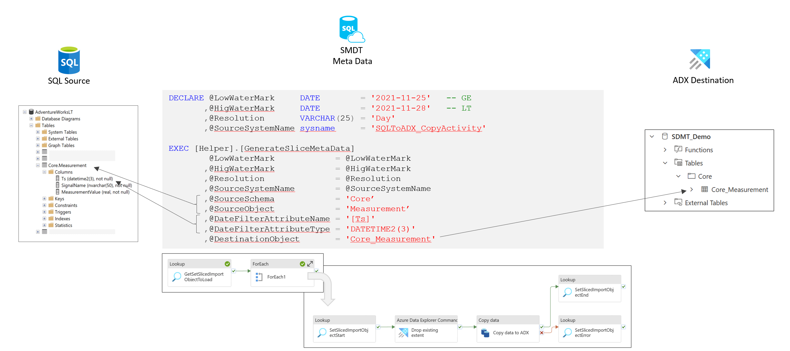
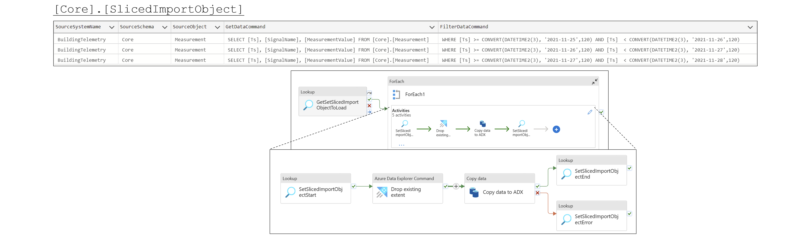
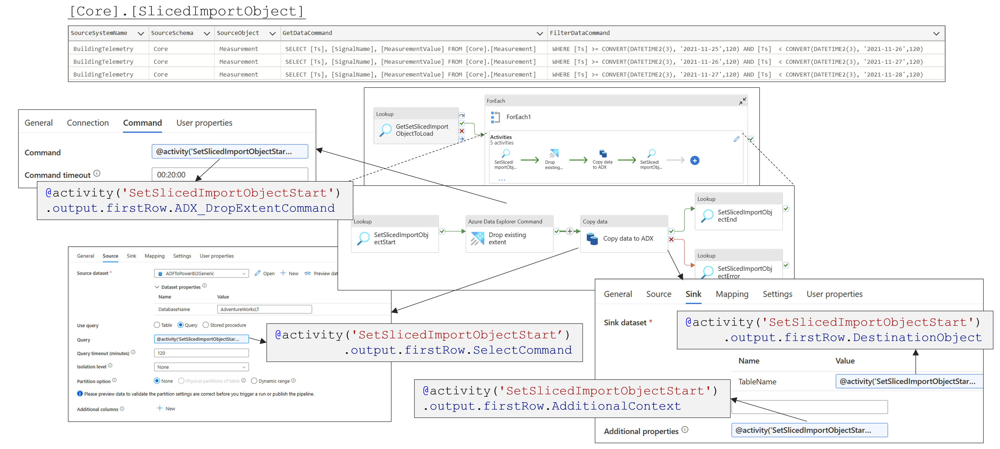

## SQL to ADX

As simple way to transfer data from a SQL database (any relational database that is supported as a copy activity source) to ADX is to use a copy activity.
 

### Scenario

#### Objects in Source Database

    CREATE SCHEMA [Core];
    GO

    CREATE TABLE [Core].[Measurement]
    (
     [Ts]                 DATETIME2(3) NOT NULL
    ,[SignalName]         NVARCHAR(50) NOT NULL
    ,[MeasurementValue]   REAL         NOT NULL
    );
    GO

    INSERT INTO [Core].[Measurement] values ('2021-11-25 12:00:03', 'Temperature',	 23.5);
    INSERT INTO [Core].[Measurement] values ('2021-11-25 12:00:04', 'Humidity',	     45.4);
    INSERT INTO [Core].[Measurement] values ('2021-11-25 12:00:04', 'Temperature',	 22.5);
    INSERT INTO [Core].[Measurement] values ('2021-11-26 12:00:07', 'Temperature',	 23.5);
    INSERT INTO [Core].[Measurement] values ('2021-11-26 12:00:07', 'Humidity',	     44.8);
    INSERT INTO [Core].[Measurement] values ('2021-11-26 12:00:09', 'Temperature',	 25.0);
    INSERT INTO [Core].[Measurement] values ('2021-11-27 12:00:07', 'Humidity',	     44.8);
    INSERT INTO [Core].[Measurement] values ('2021-11-27 12:00:09', 'Temperature',	 25.0);

#### Destination table in ADX

    .create table Measurement (Ts:datetime, SignalName:string, MeasurementValue:decimal)

#### Transfer
The transfer should happen in day slices (2021-11-25, 2021-11-26, 2021-11-27). Then you have to generate the slices with the following T-SQL command.  

    DECLARE  @LowWaterMark     DATE         = '2021-11-25'   -- GE
            ,@HigWaterMark     DATE         = '2021-11-28'   -- LT   
            ,@Resolution       VARCHAR(25)  = 'Day'   -- Day/Month
            ,@SourceSystemName sysname      = 'SQLToADX_CopyActivity'
    
    EXEC [Helper].[GenerateSliceMetaData] 
             @LowWaterMark            = @LowWaterMark
            ,@HigWaterMark            = @HigWaterMark
            ,@Resolution              = @Resolution
            ,@SourceSystemName        = @SourceSystemName
            ,@SourceSchema            = 'Core'
            ,@SourceObject            = 'Measurement'
            ,@DateFilterAttributeName = '[Ts]'
            ,@DateFilterAttributeType = 'DATETIME2(3)' -- Datatype should match to source table
            ,@DestinationObject       = 'Measurement'

    GO

This will automatically generate a SQL statement 'SELECT * FROM Core.Measurement', assuming that all attributes sould be transferred.

 

 

You can specify the SQL statement by providing a value for the parmeter `@GetDataCommand`

    DECLARE  @LowWaterMark     DATE         = '2021-11-25'   -- GE
            ,@HigWaterMark     DATE         = '2021-11-28'   -- LT   
            ,@Resolution       VARCHAR(25)  = 'Day'   -- Day/Month
            ,@SourceSystemName sysname      = 'SQLToADX_CopyActivity'
    
    EXEC [Helper].[GenerateSliceMetaData] 
             @LowWaterMark            = @LowWaterMark
            ,@HigWaterMark            = @HigWaterMark
            ,@Resolution              = @Resolution
            ,@SourceSystemName        = @SourceSystemName
            ,@SourceSchema            = 'Core'
            ,@SourceObject            = 'Measurement'
            ,@GetDataCommand          = 'SELECT [Ts], [SignalName], [MeasurementValue] FROM [Core].[Measurement]'
            ,@DateFilterAttributeName = '[Ts]'
            ,@DateFilterAttributeType = 'DATETIME2(3)' -- Datatype should match to source table
            ,@DestinationObject       = 'Measurement'

 

[Script to create the objects](../../sqldb/SDMT_DB/ScriptToGenerateMetaTestData/ToADX/SQLtoADX_CopyActivity.sql)

#### Pipeline

A pipeline pipeline to transfert the data from SQL to ADX using the copy activity will require the following aritifacts:
 * Lookup to get a list of the slices
 * ForEach activity to iterate over the list
   * Loookup activity to record the start for the slice and to get the required property values
   * An ADX command activity to clean up old data in the corresponding ADX slice (extent)
   * A copy activity to do the data transfer
   * Lookup activites to record the successful end or error, depending on the output of the copy activity

**Pipeline Overview**

**Property Settings**

**Property Values at runtime**

