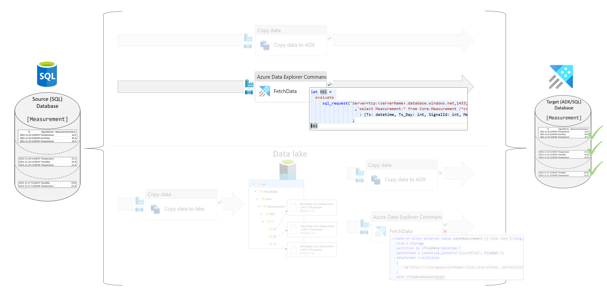

## SQL to ADX using the sql_request function

ADX is capable to read data from a remote SQL Server database. The the sql_request function is used to execute a SQL statement on a remote SQL Server database. The function returns a table with the result of the SQL statement. The function is used in the following way:

    sql_request("Server=<server>;Database=<database>;User Id=<user>;Password=<password>", "SELECT * FROM Core.Measurement")
 

### Scenario

The following scenario is used to explain the concept. The source database is a SQL database and the destination is an ADX database. The data is transferred in day slices. The data is partitioned by the column `Ts`.
The data is transferred from the source table `Core.Measurement` to the destination table `Measurement`. 

 
 

You can find a step guide in the file 

#### Source Files

 [Objects and SQL meta data](./LakeToADX_ADXFunction.sql)
 [Pipeline](pipeline\toADX\SQL-Copy-ADX\SDMT-SQLorLake-ViaFunctionTo-ADX.json)

