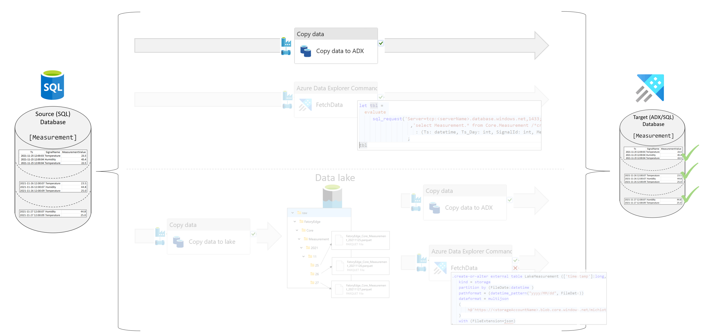
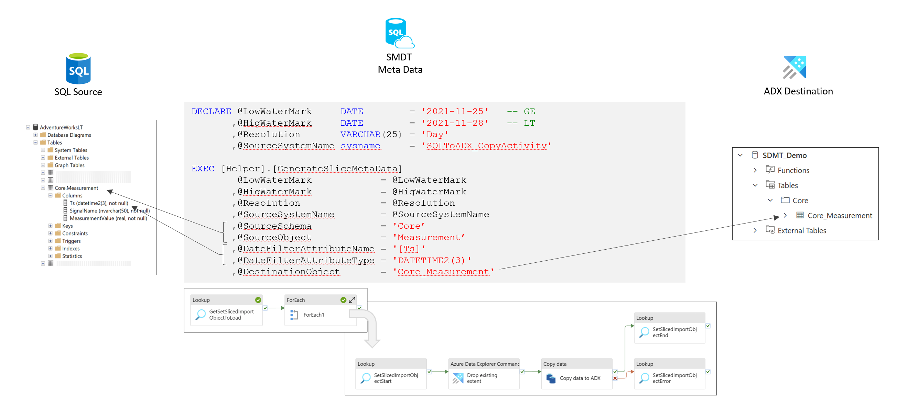
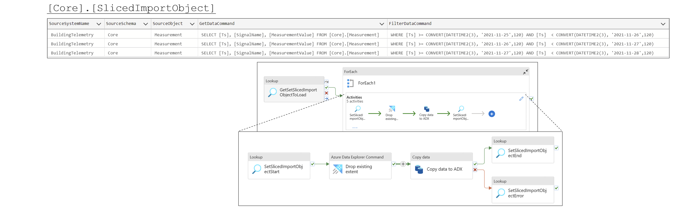
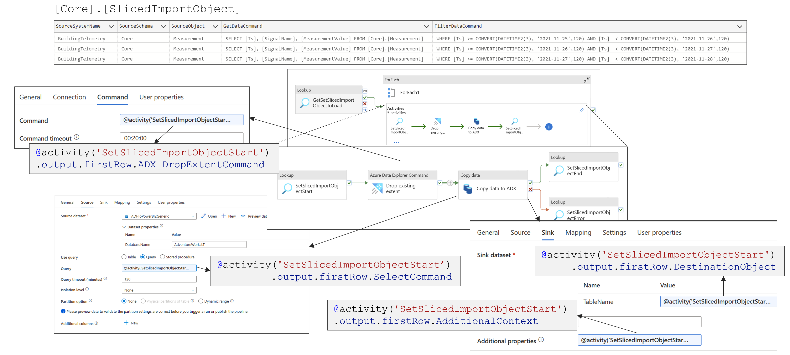
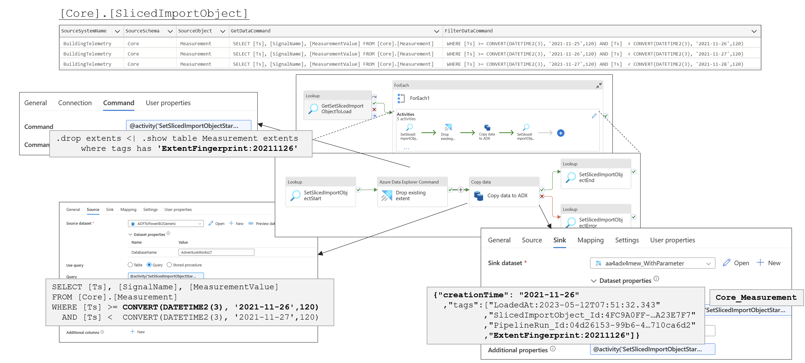

# Transfer SQL to ADX using copy activity

## Table of content

- [Transfer SQL to ADX using copy activity](#transfer-sql-to-adx-using-copy-activity)
  - [Table of content](#table-of-content)
  - [SQL to ADX using the copy activity](#sql-to-adx-using-the-copy-activity)
    - [Scenario](#scenario)
      - [Objects in Source Database](#objects-in-source-database)
      - [Destination table in ADX](#destination-table-in-adx)
      - [Transfer](#transfer)
      - [Pipeline](#pipeline)
      - [You can implement it yourself by executing the following steps](#you-can-implement-it-yourself-by-executing-the-following-steps)
        - [Create the ADF/Synapse pipeline](#create-the-adfsynapse-pipeline)
        - [Create the source and destination objects](#create-the-source-and-destination-objects)
        - [Define Slice meta data](#define-slice-meta-data)
        - [Test the transfer](#test-the-transfer)
      - [Summary and next steps](#summary-and-next-steps)

## SQL to ADX using the copy activity 

As simple way to transfer data from a SQL database (any relational database that is supported as a copy activity source) to ADX is to use a copy activity.
 

### Scenario

The following scenario is used to explain the concept. The source database is a SQL database and the destination is an ADX database. The data is transferred in day slices. The data is partitioned by the column `Ts`.
The data is transferred from the source table `Core.Measurement` to the destination table `Measurement`. 

#### Objects in Source Database

The sample reqires a SQL database with the following objects.

    CREATE SCHEMA [Core];
    GO

    CREATE TABLE [Core].[Measurement]
    (
     [Ts]                 DATETIME2(3) NOT NULL
    ,[SignalName]         NVARCHAR(50) NOT NULL
    ,[MeasurementValue]   REAL         NOT NULL
    );
    GO

    INSERT INTO [Core].[Measurement] values ('2021-11-25 12:00:03', 'Temperature',	 23.5);
    INSERT INTO [Core].[Measurement] values ('2021-11-25 12:00:04', 'Humidity',	     45.4);
    INSERT INTO [Core].[Measurement] values ('2021-11-25 12:00:04', 'Temperature',	 22.5);
    INSERT INTO [Core].[Measurement] values ('2021-11-26 12:00:07', 'Temperature',	 23.5);
    INSERT INTO [Core].[Measurement] values ('2021-11-26 12:00:07', 'Humidity',	     44.8);
    INSERT INTO [Core].[Measurement] values ('2021-11-26 12:00:09', 'Temperature',	 25.0);
    INSERT INTO [Core].[Measurement] values ('2021-11-27 12:00:07', 'Humidity',	     44.8);
    INSERT INTO [Core].[Measurement] values ('2021-11-27 12:00:09', 'Temperature',	 25.0);

#### Destination table in ADX

The sample reqires a ADX database with the following objects.

    .create table Core_Measurement (Ts: datetime, SignalName: string, MeasurementValue: real) with (folder = "Core")

 

#### Transfer
The transfer should happen in day slices (2021-11-25, 2021-11-26, 2021-11-27). Then you have to generate the slices with the following T-SQL command.  

    DECLARE  @LowWaterMark     DATE         = '2021-11-25'   -- GE
            ,@HigWaterMark     DATE         = '2021-11-28'   -- LT   
            ,@Resolution       VARCHAR(25)  = 'Day'   -- Day/Month
            ,@SourceSystemName sysname      = 'SQLToADX_CopyActivity'
    
    EXEC [Helper].[GenerateSliceMetaData] 
            @LowWaterMark            = @LowWaterMark
            ,@HigWaterMark            = @HigWaterMark
            ,@Resolution              = @Resolution
            ,@SourceSystemName        = @SourceSystemName
            ,@SourceSchema            = 'Core'
            ,@SourceObject            = 'Measurement'
            ,@DateFilterAttributeName = '[Ts]'
            ,@DateFilterAttributeType = 'DATETIME2(3)' 
            ,@DestinationObject       = 'Core_Measurement'

    GO

This will automatically generate a SQL statement 'SELECT * FROM Core.Measurement', assuming that all attributes sould be transferred.

 

You can specify the SQL statement by providing a value for the parmeter `@GetDataCommand`. This allow you to restrict the columns that are transferred or to do any kind of required transformations on the source side.

    DECLARE  @LowWaterMark     DATE         = '2021-11-25'   -- GE
            ,@HigWaterMark     DATE         = '2021-11-28'   -- LT   
            ,@Resolution       VARCHAR(25)  = 'Day'   -- Day/Month
            ,@SourceSystemName sysname      = 'SQLToADX_CopyActivity'
    
    EXEC [Helper].[GenerateSliceMetaData] 
             @LowWaterMark            = @LowWaterMark
            ,@HigWaterMark            = @HigWaterMark
            ,@Resolution              = @Resolution
            ,@SourceSystemName        = @SourceSystemName
            ,@SourceSchema            = 'Core'
            ,@SourceObject            = 'Measurement'
            ,@GetDataCommand          = 'SELECT [Ts], [SignalName], [MeasurementValue] FROM [Core].[Measurement]'
            ,@DateFilterAttributeName = '[Ts]'
            ,@DateFilterAttributeType = 'DATETIME2(3)' -- Datatype should match to source table
            ,@DestinationObject       = 'Core_Measurement'

 

#### Pipeline

A pipeline pipeline to transfert the data from SQL to ADX using the copy activity will require the following aritifacts:
 * Lookup to get a list of the slices
 * ForEach activity to iterate over the list
   * Loookup activity to record the start for the slice and to get the required property values
   * An ADX command activity to clean up old data in the corresponding ADX slice (extent)
   * A copy activity to do the data transfer
   * Lookup activites to record the successful end or error, depending on the output of the copy activity

**Pipeline Overview**

**Property Settings**

**Property Values at runtime**

#### You can implement it yourself by executing the following steps

##### Create the ADF/Synapse pipeline

Make sure that you have the required datasets and linked servers defined in your Azure Data Factory or in your Azure Synapse Analytics workspace. You can find a list of the required objects in: [Setup](./../../../doc/01SetupSMDT.md). 

Create a new pipeline with the name 'SDMT-SQL-Copy-ADX-Minimal', switch to the json view and copy the code from the file [SDMT-SQL-Copy-ADX-Minimal.json](./../../../pipeline/ToADX/SQL-Copy-ADX/SDMT-SQL-Copy-ADX-Minimal.json) into the pipeline.

If you would like to have control over the data transfer, you can use the pipeline [SDMT-SQL-Copy-ADX-ConditionalDelete.json](./../../../pipeline/ToADX/SQL-Copy-ADX/SDMT-SQL-Copy-ADX-ConditionalDelete.json). This pipeline has a conditional activity and a corresponding parameter to define if the target data slice should be deleted before the slice is transmitted. The pipeline 'SDMT-SQL-Copy-ADX-Minimal' will always delete the target data slice before the data is transmitted.

##### Create the source and destination objects

Select the table that you would like to transfer from the source database and the destination database. The sample uses the following objects.

    SQL Source: [Core].[Measurement]
    ADX Destination: [Core_Measurement]

You find the code to create the sample objects in the file [SQLtoADX_CopyActivity.sql](./../../../sqldb/SDMT_DB/ScriptToGenerateMetaTestData/ToADX/SQLToADX_CopyActivity.sql).

##### Define Slice meta data

The slice meta data is used to control the data transfer. The sample uses the following values.

    LowWaterMark: 2021-11-25
    HighWaterMark: 2021-11-28
    Resolution: Day
    ...

You can either use it as it is or adjust it to your specific needs.

You find the code to create the sample meta data in the file [SQLtoADX_CopyActivity.sql](./../../../sqldb/SDMT_DB/ScriptToGenerateMetaTestData/ToADX/SQLToADX_CopyActivity.sql).

##### Test the transfer

The system is now ready to be tested. Just execute the pipeline and check the results in ADX and also in the meta data table `[Core].[SlicedImportObject]`.

#### Summary and next steps

You have now a working pipeline to transfer data from a SQL database to an ADX database. The next step is to adjust the pipeline to your specific needs. You can also use the pipeline as a template for your own pipelines.

 

The advantage of using the copy activity is that you don't have to create any addition abjects in your ADX target database and that the whole process is very simple and transparent.
The drawback is that you don't achieve the best ingest performance and that the data transfer can get more expensive that necessary.

 

There are other way to do the data transfer. You can either fetch the data from the SQL database using the sql_request function or you can write the data to a data lake and ingest the data from the data lake into ADX. The next sections will explain these options.

More details are available in the files:
 * [Transfer SQL to ADX using ADX function](./20SQLToADX_ADXFunction.md)
 * [Transfer Lake to ADX using ADX function](./25LakeToADX_ADXFunction.md)
 * [Transfer SQL to Lake using copy activity](./../ToLake/30SQLToLakeCopy.md)
 * [Transfer SQL to Lake to ADX using copy activity and ADX function](./35SQLToLakeToADXFunction.md)
 
