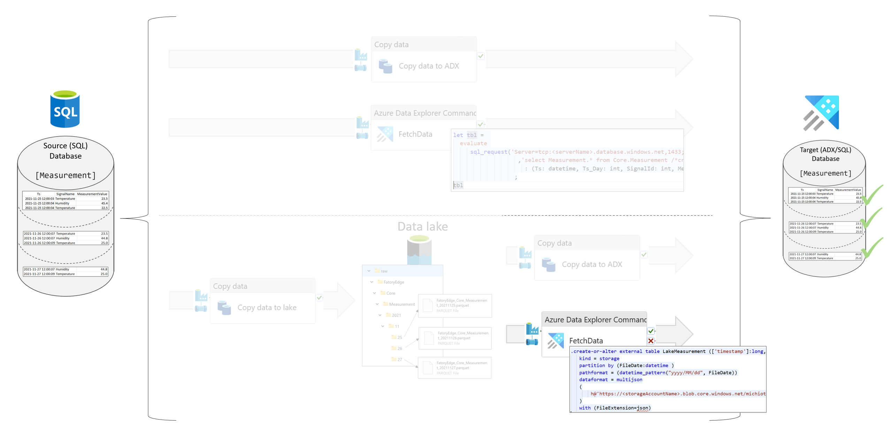

## Lake to ADX using an external table and an ADX function

ADX is capable to read data from files in the data lake. This is done via an external table. The external table is defined in ADX and points to the files in the data lake. An ADX function is used to filter the data in the data lake. 

KQL syntax to create an external table is:

    .create external table <TableName> ( <ColumnList> ) 
    kind=adl
    partition by <PartitionColumn>
    dataformat=parquet
    ( 
        <Folder> + '/' + <FileNamePattern>
    )

 

### Scenario

The following scenario is used to explain the concept. The source is a folder structure with files in the data lake and the destination is an ADX database. The data is transferred in day slices. The data is partitioned by a folder structure YYYY/MM/DD.
The data is transferred from lake to the destination table `Core_Measurement`. 

 
 

You can find a step guide, how to define metadata and deploy the pipeline in [Details](./10SQLToADXCopy.md)

#### Source Files
 * [Required objects (SQL + ADX) and SQL meta data](./../../sqldb/SDMT_DB/ScriptToGenerateMetaTestData/ToADX/LakeToADX_ADXFunction.sql)
 * Pipeline definition 
   * [Pipeline calling ADX function with one string parameter ('YYYYMMDD')](./../../pipeline/toADX/SQLtoLake-FunctionCall-ADX/SDMT-SQLorLake-ViaFunctionTo-ADX.json)
   * [Pipeline calling ADX function with one string parameter ('YYYYMMDD'), conditional delete](./../../pipeline/toADX/SQLtoLake-FunctionCall-ADX/SDMT-SQLorLake-ViaFunctionTo-ADX-ConditionalDelete.json)

