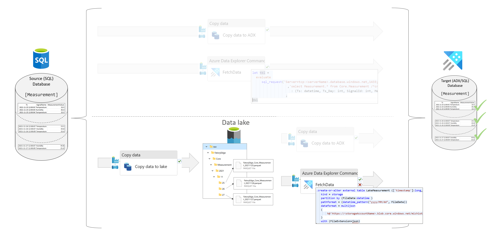

# Transfer data from SQL to the data lake and from the data lake to ADX using a function and an external table

## Table of Contents

- [Transfer data from SQL to the data lake and from the data lake to ADX using a function and an external table](#transfer-data-from-sql-to-the-data-lake-and-from-the-data-lake-to-adx-using-a-function-and-an-external-table)
  - [Table of Contents](#table-of-contents)
  - [SQL to Lake using an ADF/Synapse Pipeline copy activity, then Lake to ADX using an external table and an ADX function](#sql-to-lake-using-an-adfsynapse-pipeline-copy-activity-then-lake-to-adx-using-an-external-table-and-an-adx-function)
    - [Scenario](#scenario)
      - [Source Files](#source-files)

 

## SQL to Lake using an ADF/Synapse Pipeline copy activity, then Lake to ADX using an external table and an ADX function

This is a combination of the two scenarios [SQL to Lake using an ADF/Synapse Pipeline copy activity](./30SQLToLakeCopy.md) and [Lake to ADX using an external table and an ADX function](./25LakeToADX_ADXFunction.md).
 

### Scenario

The source is a table in the Azure SQL database `Core.Measurement` and the destination is the ADX table `Core_Measurement`. In the first step the slice is copied from the SQL database to the folder structure in the data lake. Then in a second step copied from the external table (ADX) to the final destination table.

 
 

You can find a step guide, how to define metadata and deploy the pipeline in [Details](./10SQLToADXCopy.md)

#### Source Files
 * [Required objects (SQL + ADX) and SQL meta data](./../../../sqldb/SDMT_DB/ScriptToGenerateMetaTestData/ToADX/SQLToLakeToADX_CopyActivityAndADXFunction.sql)
 * Pipeline definition 
   * [Pipeline calling ADX function with one string parameter ('YYYYMMDD')](./../../../pipeline/ToADX/SQLtoLake-FunctionCall-ADX/SDMT-SQL-Lake-ADX-ViaFunctionTo-ADX-ConditionalDelete.json)
   

