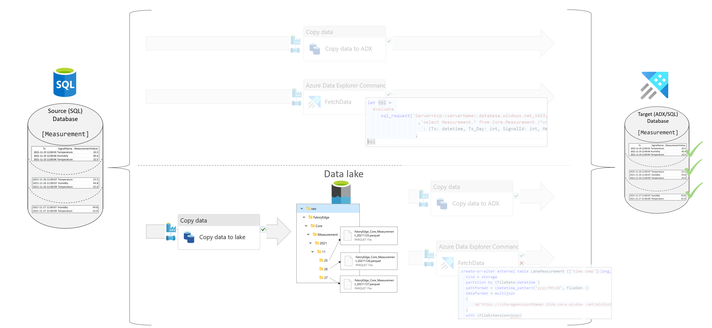

# Transfer data from SQL to the data lake using a copy activity

## Table of Contents
- [Transfer data from SQL to the data lake using a copy activity](#transfer-data-from-sql-to-the-data-lake-using-a-copy-activity)
  - [Table of Contents](#table-of-contents)
  - [SQL to Lake using an ADF/Synapse Pipeline copy activity](#sql-to-lake-using-an-adfsynapse-pipeline-copy-activity)
    - [Scenario](#scenario)
      - [Source Files](#source-files)

 

## SQL to Lake using an ADF/Synapse Pipeline copy activity

As simple way to transfer data from a SQL database (any relational database that is supported as a copy activity source) to the data lake is to use a copy activity.
 

### Scenario

The source is a table in the Azure SQL database `Core.Measurement` and the destination is a folder structure with files in the data lake. The data is partitioned by a folder structure YYYY/MM/DD.

 
 

You can find a step guide, how to define metadata and deploy the pipeline in [Details](./../../transfer/ToADX/10SQLToADXCopy.md)

#### Source Files
 * [Required objects (SQL + ADX) and SQL meta data](./../../../sqldb/SDMT_DB/ScriptToGenerateMetaTestData/ToLake/SQLToLakeMultipleFileToADX.sql)
 * Pipeline definition 
   * [Pipeline using a copy activity](./../../../pipeline/ToLake/SDMT-SQL-Lake.json)
   

